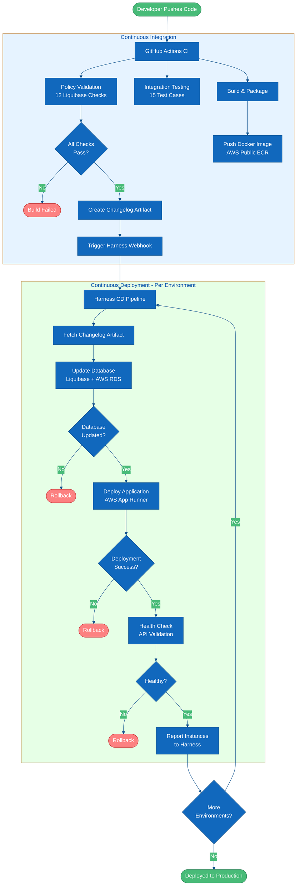
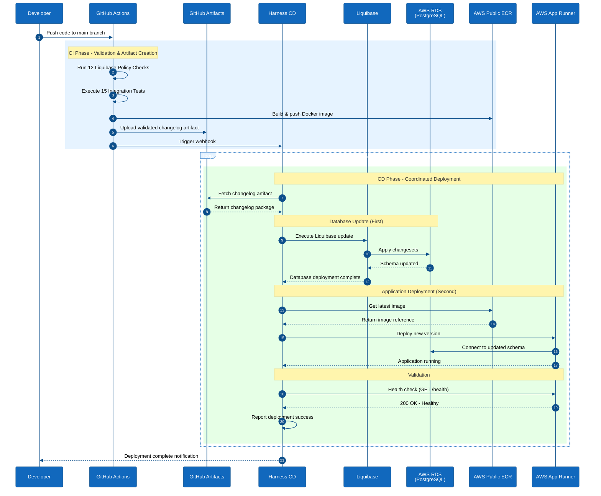
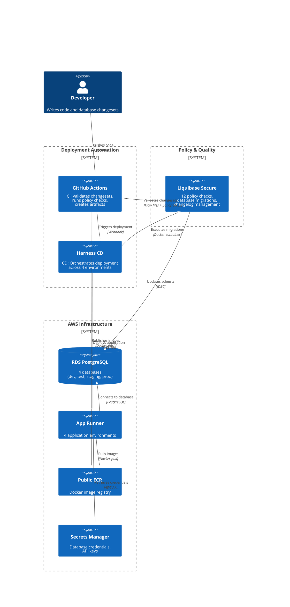

# Architecture Diagrams

Customer-ready visualizations of the coordinated database and application deployment pattern.

## Overview

This document contains 4 different visualization approaches for presenting the architecture to customers. Each diagram emphasizes:

- **Coordinated Deployment Pattern**: Database changes deployed and validated before application updates
- **Policy-Driven Quality Gates**: 12 Liquibase policy checks enforce standards before deployment
- **Multi-Environment Progression**: Automated promotion through dev → test → staging → prod
- **AWS Infrastructure**: Production-grade deployment using RDS and App Runner

---

## 1. CI/CD Pipeline Flow (Mermaid Flowchart)

**Best for:** Showing the complete journey from code commit to production deployment.

**Use when:** You want to explain the end-to-end automation workflow.



**Key Message:** Database changes are validated with policy checks, then deployed before the application - ensuring schema compatibility.

---

## 2. Deployment Orchestration (Mermaid Sequence Diagram)

**Best for:** Showing the time-based coordination between systems during deployment.

**Use when:** You want to emphasize the sequential orchestration and system interactions.



**Key Message:** The sequence shows the critical coordination - database schema is updated BEFORE the application is deployed, ensuring compatibility.

---

## 3. System Context (Mermaid C4 Diagram)

**Best for:** Showing system boundaries and how external systems interact.

**Use when:** You want to show the big picture of system components and their relationships.



**Key Message:** The system demonstrates coordinated deployment by orchestrating database schema updates (Liquibase → RDS) before application deployment (App Runner).

---

## 4. Modern Alternative (D2 Diagram)

**Best for:** Modern aesthetics with automatic layout optimization.

**Use when:** You want a more contemporary look with better visual hierarchy.

**D2 Source Code:**

```d2
# Coordinated Database & Application Deployment Architecture

direction: right

developer: Developer {
  shape: person
  style.fill: "#48bb78"
}

ci: GitHub Actions CI {
  validate: Policy Validation {
    icon: https://icons.terrastruct.com/essentials/112-shield-checkmark.svg
    style.fill: "#e6f3ff"
  }
  test: Integration Testing {
    icon: https://icons.terrastruct.com/essentials/321-test-tube.svg
    style.fill: "#e6f3ff"
  }
  artifact: Create Artifact {
    icon: https://icons.terrastruct.com/essentials/087-archive.svg
    style.fill: "#e6f3ff"
  }

  validate -> test -> artifact
}

harness: Harness CD Pipeline {
  style.fill: "#fff3e6"

  stages: "4 Environments" {
    dev: Dev
    test: Test
    staging: Staging
    prod: Prod

    dev -> test -> staging -> prod
  }

  steps: "Deployment Steps (per env)" {
    fetch: Fetch Changelog
    db: Update Database {
      icon: https://icons.terrastruct.com/aws/Database/Amazon-RDS.svg
      style.fill: "#527FFF"
    }
    app: Deploy Application {
      icon: https://icons.terrastruct.com/aws/Compute/AWS-App-Runner.svg
      style.fill: "#FF9900"
    }
    health: Health Check

    fetch -> db -> app -> health
  }
}

aws: AWS Infrastructure {
  rds: RDS PostgreSQL {
    shape: cylinder
    icon: https://icons.terrastruct.com/aws/Database/Amazon-RDS.svg
    style.fill: "#527FFF"
  }

  apprunner: App Runner {
    icon: https://icons.terrastruct.com/aws/Compute/AWS-App-Runner.svg
    style.fill: "#FF9900"
  }

  secrets: Secrets Manager {
    icon: https://icons.terrastruct.com/aws/Security-Identity-Compliance/AWS-Secrets-Manager.svg
    style.fill: "#DD344C"
  }
}

liquibase: Liquibase Secure {
  checks: "12 Policy Checks" {
    style.fill: "#e6ffe6"
  }
  style.fill: "#2962FF"
}

# Relationships
developer -> ci: "git push"
ci -> harness: "trigger webhook" {
  style.stroke-dash: 3
}

harness.steps.db -> liquibase: "execute migration"
liquibase -> aws.rds: "apply changesets"

harness.steps.app -> aws.apprunner: "deploy new version"
aws.apprunner -> aws.rds: "connect to updated schema"
aws.apprunner -> aws.secrets: "retrieve credentials"

# Key Message
note: "Database schema updated FIRST,\nthen application deployed -\nensuring compatibility" {
  near: harness.steps
  style.fill: "#fff9e6"
  style.stroke: "#f6ad55"
  style.font-size: 16
}
```

**Rendering Instructions:**
```bash
# Install D2
brew install d2  # macOS
# or download from https://d2lang.com

# Render to SVG
d2 architecture.d2 architecture.svg

# Render to PNG
d2 architecture.d2 architecture.png

# With specific theme
d2 --theme=200 architecture.d2 output.svg
```

**Key Message:** Modern, clean visualization with automatic layout and icon support.

---

## Rendering & Export Instructions

### Mermaid Diagrams

**Option 1: GitHub/GitLab (Native Rendering)**
- Paste Mermaid code directly in markdown files
- Renders automatically in GitHub/GitLab UI

**Option 2: Mermaid Live Editor**
1. Visit https://mermaid.live
2. Paste diagram code
3. Export as SVG or PNG
4. Download for presentations

**Option 3: Command Line (mermaid-cli)**
```bash
# Install
npm install -g @mermaid-js/mermaid-cli

# Render to PNG
mmdc -i diagram.mmd -o diagram.png -b transparent

# Render to SVG
mmdc -i diagram.mmd -o diagram.svg

# High resolution for presentations
mmdc -i diagram.mmd -o diagram.png -w 2400 -H 1600
```

**Option 4: VS Code Extension**
1. Install "Markdown Preview Mermaid Support" extension
2. Open markdown file with mermaid diagram
3. Preview renders diagram inline
4. Right-click diagram → Save as SVG/PNG

### D2 Diagrams

```bash
# Install D2
brew install d2  # macOS
curl -fsSL https://d2lang.com/install.sh | sh -s --  # Linux

# Render with different themes
d2 --theme=0 diagram.d2 output.svg    # Neutral default
d2 --theme=200 diagram.d2 output.svg  # Terminal
d2 --theme=201 diagram.d2 output.svg  # Cool classics

# High resolution export
d2 --pad=40 diagram.d2 output.svg
```

---

## Integration with Reveal.js Presentation

Add diagrams to your existing `presentation/index.html`:

### Method 1: Embed Mermaid Directly

```html
<section>
  <h2>Architecture Overview</h2>
  <div class="mermaid">
    <!-- Paste Mermaid diagram code here -->
    flowchart TB
      Start([Developer Push]) --> GHA[GitHub Actions]
      <!-- ... rest of diagram ... -->
  </div>
</section>

<!-- Add Mermaid plugin at end of file -->
<script type="module">
  import mermaid from 'https://cdn.jsdelivr.net/npm/mermaid@10/dist/mermaid.esm.min.mjs';
  mermaid.initialize({ startOnLoad: true });
</script>
```

### Method 2: Use SVG Export

```html
<section>
  <h2>Architecture Overview</h2>
  
</section>
```

### Method 3: Progressive Reveal

```html
<section>
  <h2>Deployment Coordination</h2>
  
  <div class="fragment">
    <h3>Key Benefits:</h3>
    <ul>
      <li class="fragment">Database schema validated before deployment</li>
      <li class="fragment">Application always compatible with current schema</li>
      <li class="fragment">Automated rollback on any failure</li>
    </ul>
  </div>
</section>
```

---

## Recommendations

### For Different Audiences

| Audience | Recommended Diagram | Why |
|----------|-------------------|-----|
| **Executives** | C4 Context Diagram | Shows big picture, system boundaries, minimal technical detail |
| **Technical Architects** | CI/CD Pipeline Flow | Shows complete automation workflow, decision points, quality gates |
| **DevOps Engineers** | Sequence Diagram | Shows time-based orchestration, system interactions, coordination |
| **Marketing/Sales** | D2 Diagram (modern style) | Contemporary aesthetics, visual appeal, easy to understand |

### For Different Presentation Contexts

| Context | Format | Approach |
|---------|--------|----------|
| **Live Demo** | Mermaid in Reveal.js | Interactive, can zoom/highlight sections |
| **PDF Report** | SVG export (high-res) | Crisp at any zoom level, small file size |
| **PowerPoint** | PNG export (2400x1600) | High resolution, works everywhere |
| **Documentation** | Mermaid in markdown | Version controlled, renders on GitHub |
| **Blog Post** | D2 SVG export | Modern look, professional appearance |

### Multi-Diagram Strategy

For a comprehensive presentation, use this progression:

1. **Slide 1**: C4 Context Diagram
   - "Here's what we built - the big picture"

2. **Slide 2**: CI/CD Pipeline Flow
   - "Here's how it works - the automation journey"

3. **Slide 3**: Sequence Diagram (zoom into one environment)
   - "Here's the coordination pattern - database first, then app"

4. **Slide 4**: Results/Benefits
   - Screenshots, metrics, customer impact

---

## Customization Tips

### Changing Colors

**Mermaid (Theme Variables):**
```
%%{init: {'themeVariables': {
  'primaryColor':'#YOUR_COLOR',
  'primaryBorderColor':'#YOUR_BORDER',
  'lineColor':'#YOUR_LINE'
}}}%%
```

**D2 (Style Overrides):**
```d2
object: {
  style.fill: "#YOUR_COLOR"
  style.stroke: "#YOUR_BORDER"
}
```

### Adding Your Branding

1. **Export to SVG**
2. **Open in Figma/Illustrator/Inkscape**
3. **Add logo, adjust colors, refine layout**
4. **Export final version**

### Simplifying for Time Constraints

If presenting to a time-constrained audience:
- **Remove**: Test/validation steps
- **Keep**: Database → App coordination
- **Emphasize**: "Schema updated before app deployed"

---

## Quick Start

**To get a customer-ready diagram in 2 minutes:**

1. Copy the **CI/CD Pipeline Flow** Mermaid code above
2. Go to https://mermaid.live
3. Paste the code
4. Click "Download PNG" (or SVG for higher quality)
5. Add to your presentation deck

**Result:** Professional architecture diagram ready for customer presentation.

---

## Questions?

- **Can't decide which diagram?** → Use the CI/CD Pipeline Flow (most comprehensive)
- **Need to edit/customize?** → Mermaid Live Editor is easiest
- **Want modern aesthetics?** → Try D2 diagrams
- **Presenting in 5 minutes?** → Export PNG from Mermaid Live, drop in slides
- **Need high resolution?** → Export SVG (infinite resolution) or 2400x1600 PNG

For more details on the architecture, see [CLAUDE.md](../CLAUDE.md).
